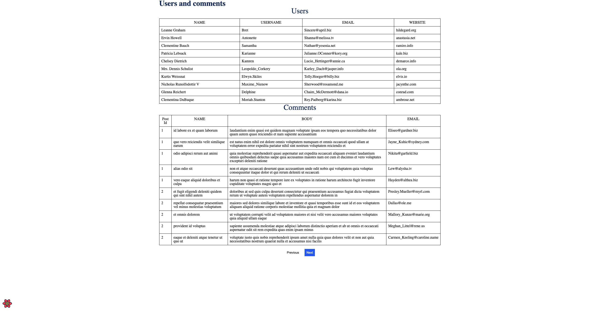

# USERS AND COMMENTS

## Setup

1. Clone the repository 
2. Run `yarn` to install dependencies 
3. Run `yarn start`. The app will run on `localhost:3000`

---

## Stack 
- React(CRA) + Typescript 
- styled-components 
- react-query
- axios
- jest, react-testing-library 

---

## Tooling 
- eslint + prettier
- husky (commit-msg, pre-commit) + commitlint

---
## Conventions
### Folder structure
In the src directory there are libraries (methods used outside a lib should be exportet from index file):
- `http-client` contains axios wrapper and http service with GET method, ready to be extended
- `jsonplaceholder-connector` contains users and comments APIs, connects the app with jsonplaceholder API
- `models` contains data services and DTO mappers, react-query takes care of server state and caches data for 1hr
- `ui-kit` contains components related to UI like Layout, Table, Typography etc. 
- `views` (might be renamed to pages) contains components composition 

### File names

- `Name.component.tsx` - contains component and it's interface
- `Name.styles.ts` - contains styles 
- `Name.spec.ts|tsx` - contains tests 
- `Name.conts.ts` - contains contant values, eg. mock data, config, theme
- `Name.service` - contains data fetching hook 
- `Name.helpers.ts` - contains helper maping API response to DTO
- `Name.types.ts` - contains DTO types
- `Name.utils.ts` - contains small, helper functions

### Convetional commits 
[DOCS](https://www.conventionalcommits.org/en/v1.0.0/)

---
## Tests 
Due to time limitations there are only serveral tests just to show the approach. Simple util functions are unit tested, Pagination component is covered by semi e2e tests with user interaction. 

Test script  `yarn test`

---

## What could be done to polish the app

- design the app, change the font, add spaces between elements, style elements, add skeletons, empty states, error states 
- add logger service
- add routing 
- add i18y, put messages in centralized json file
- increase test coverage 
- add CI/CD tooling (eg. circleCI)
- work on branches instead of pushing to main, create PRs with description
- properly fix linting errors
